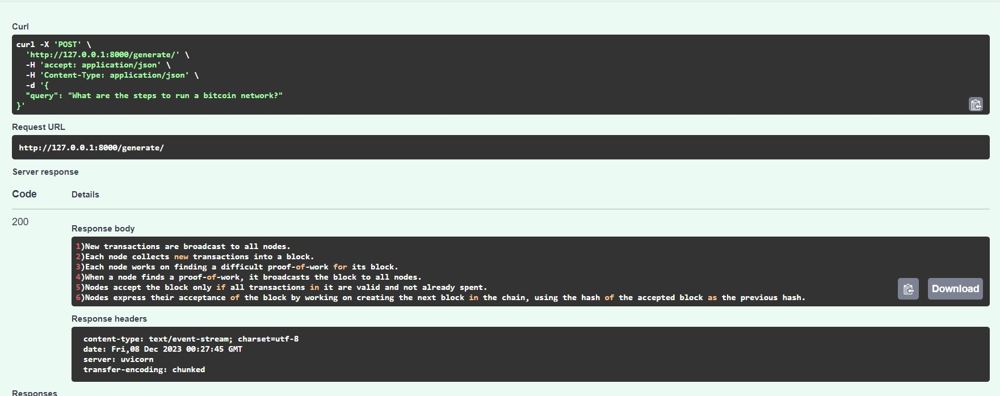

# GenAI
*Implementations of LLMs for different use cases*

I divide RAG pipelines to be a three step process - 1.) Chunking 2.)Vectordb and persistence 3.) Output Generation  \
\
Creating right chunks for specific use cases is the most important part in getting accurate answers. Work is required around this part. To persist data we are using sqlitedb. Other databases like in-memory or Postgresql can also be used. For indexing the vectors and performing vector search we are using faiss db. We can also use different sentence transformers model to see the difference in accuracy according to our use case.

### RAG
For the project under RAG is a implenetation of the piepline with native python modules. This gives us a lot of control over our pipeline and prevents us from using any bloated python SDKs. Here we can clearly understand and control our chain and retrievals, set prompts easily, see the right chunk(context) of data being passed and modify those according to our needs.

##### GETTING STARTED

  Clone the repo. -
  ```
git clone https://github.com/abhinav23484/GenAI.git 
```
CD to RAG -
```
CD RAG
``` 
  Create an environment -
```
python -m venv path-to-project_dir/GenAI/RAG/venv 
```
Activate the environment -
```
source venv/bin/activate 
```
Install dependencies -
```
pip install requirements.txt 
```
Run it as an endpoint -
```
uvicorn main:app --reload 
```
The endpoint can be tested at - http://127.0.0.1:8000/docs 

Example run - (The document/dataset used here is RAG/datasets/bitcoin.pdf)


Here the model is loaded using ctransformers. [Ctransformers](https://github.com/marella/ctransformers)
The model parameters are : -
###### Config

| Parameter            | Type        | Description                                                     | Default |
| :------------------- | :---------- | :-------------------------------------------------------------- | :------ |
| `top_k`              | `int`       | The top-k value to use for sampling.                            | `40`    |
| `top_p`              | `float`     | The top-p value to use for sampling.                            | `0.95`  |
| `temperature`        | `float`     | The temperature to use for sampling.                            | `0.8`   |
| `repetition_penalty` | `float`     | The repetition penalty to use for sampling.                     | `1.1`   |
| `last_n_tokens`      | `int`       | The number of last tokens to use for repetition penalty.        | `64`    |
| `seed`               | `int`       | The seed value to use for sampling tokens.                      | `-1`    |
| `max_new_tokens`     | `int`       | The maximum number of new tokens to generate.                   | `256`   |
| `stop`               | `List[str]` | A list of sequences to stop generation when encountered.        | `None`  |
| `stream`             | `bool`      | Whether to stream the generated text.                           | `False` |
| `reset`              | `bool`      | Whether to reset the model state before generating text.        | `True`  |
| `batch_size`         | `int`       | The batch size to use for evaluating tokens in a single prompt. | `8`     |
| `threads`            | `int`       | The number of threads to use for evaluating tokens.             | `-1`    |
| `context_length`     | `int`       | The maximum context length to use.                              | `-1`    |
| `gpu_layers`         | `int`       | The number of layers to run on GPU.                             | `0`     |

In a simlilar way the model can be loaded using llamaindex or llamacpp or using transformers itself depending on the available infrastructure.

The fastAPI host and port can be configured - 
```
uvicorn main:app --host 0.0.0.0 --port 80
```
Now this endpoint can be used to deploy and integrate it with other UI applications.
